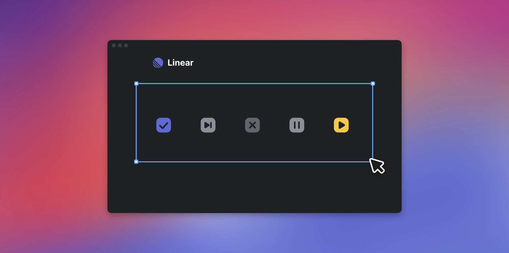

[<- Back 返回目录](README.md)

# 管理设计项目（Manage design projects）

> At Linear, we manage design tasks in the app and designers and engineers collaborate tightly when building features. The design process can seem incompatible with typical project management practices. It’s hard to predict what a design will look like at the outset of a project let alone to give estimates on when it will be ready. These are some ways that we approach design work for projects that help us strike a balance and work together effectively.

在 Linear，设计师和工程师在实现功能时紧密协作。设计的工作，看起来似乎与典型的项目管理实践不相容。在项目开始时，你很难预测设计会是什么样子，更不用说估算完成时间了。下面是我们设计工作的一些方法，帮助我们取得平衡并有效地合作。

## 验证问题（Verifying the problem）

> The first design task for any project is to understand and verify the problem. Sometimes the problem is clear and simple, such as to build out a screen. Sometimes the problem is unclear or poorly defined and needs some research before implementation. This is especially common when picking up feature requests from customers or teams that work outside of the product. Users will ask you to build a specific feature X to fix their problem Y. The sales team may push you to build feature X to meet a client request. However, their X is usually defined by their perception of the problem and limited by their understanding of how the product can be changed to resolve it. Design’s challenge is to investigate the surface-level issues to find the root cause and then solve for that. As a designer, the most important step is to verify the problem actually exists and is the right problem to solve.

任何项目的第一个设计任务都是理解和验证问题。有时候，问题是简单明了的，比如说做一个页面。有时，问题的定义很不明确，需要在实施前进行一些研究。这种情况常见于外部的客户请求。用户会要求你做一个功能 X，来解决他们的问题 Y。销售团队为了满足客户要求，会推动你去实现功能 X。然而，他们说的 X 通常是他们自己认为的解决方案，这个方案受限于他们自己对产品的理解。设计的挑战是透过表面找到根本原因，然后再想怎么解决。作为一名设计师，最重要的步骤是验证问题是否实际存在，以及是否真的是我们要解决的问题。

> At Linear, we do a lot of this design and research by playing with the product ourselves. The design team regularly reviews feature requests that come in from users through the Help + Feedback modal or in the public Slack community. We’ll discuss these as a team casually in Slack or on the Linear issue if it’s a feature we plan to implement. We also invest in writing out detailed project specs for each feature before building anything which forces us to think through the problem in depth.

在 Linear，我们通过自己使用自己的产品来进行大量的设计和研究。设计团队定期审查用户提出的功能请求，这些请求可能来自「产品帮助和反馈」或者 Slack 用户社区。如果它在我们的计划中，团队会在 Slack 中或者 Linear 的 issue 中进行讨论。在实现之前，我们也会为每个功能写出详细的规格说明，这可以迫使我们深入思考。

## 探索阶段（The exploration stage）

> Once the problem is clarified, it’s time to explore different design options. We create an issue in Linear called “Explore designs” and keep that as a placeholder issue in the project.

一旦问题得到澄清，就是探索不同设计方案的时候了。我们会在 Linear 中创建一个名为「探索设计」的 issue，将其作为项目中的一个占位 issue。

> At this stage, it’s important to explore the solution freely and without judging whether something is feasible, fits into your design system or is a good idea at all. Bad ideas are a natural step in the creative process, can help clarify your thinking, and even show you why something else is a better idea. Depending on a problem, exploration could take a few hours or a few days. It’ll include part research to learn best practices and find inspiration and part experimenting with options in Figma. A small feature might require a few takes with different UIs. A larger feature could end up going in multiple directions before you find the one that you like, usually after you’ve gotten feedback from others.

在这个阶段，重要的是要自由地探索解决方案，不要判断某件事情是否可行，是否适合你的设计系统，或者判定是不是一个好的想法。糟糕的想法是创作过程中的一个自然步骤，它可以帮助你澄清思维，甚至告诉你为什么其他的想法更好。根据问题的不同，探索可能需要几个小时或几天。它可以需要在 Figma 做一些实验和研究，以获得最佳做法和寻找灵感。一个小的功能可能需要实验很多不同的用户界面。一个较大的功能需要试验多个不同的方案，收集大家的反馈，才能确定最好的。

## 利用反馈来指导您（Using feedback to guide you）

> After some initial exploration, you should get feedback and reactions from other people starting with your teammates. Observe how they react. When they say something about the design, don’t just pay attention to what they say but ask them why they said it. You should get feedback while you are still exploring, so don’t worry about the details and polish. If people give you negative feedback, don’t take that as a sign the direction is necessarily bad but focus on learning why. It could be that you’re going in the right direction but the current version isn’t quite right or doesn’t fit into their understanding of the problem. Find the gaps in your design or the story and then fill them.

在一些初步探索之后，你应该先从你的队友开始，收集反馈和回应。观察他们的反应。当他们对设计说些什么的时候，不要只注意他们说什么，而是要问他们为什么这么说。你应该在探索的阶段就收集反馈，所以不要在意细节问题。如果人们给出负面反馈，不要认为这意味着方向错了，而是要专注于了解原因。可能你的方向是正确的，但目前的版本不太正确，或者不符合他们对问题的理解。找到当前设计中的差距，然后优化它们。

> When getting feedback on the design, alternate between reviewing the overall design and gathering input on specific details. It’s often hard for people to give good feedback on both at once and easy to go off in unhelpful tangents if feedback requests aren’t focused. Set the expectation and let people know what type of feedback would be valuable for you to receive.

在整体设计和细节意见之间，交替的收集反馈。人们通常很难同时对这两个方面提供良好的反馈，而且如果反馈不集中的话，也很容易徒劳无益。明确告诉对方，让人们知道你希望什么类型的反馈。

## 选择方向（Choosing a direction）

> Eventually you’ll need to pick a direction for the design. Fleshing out the direction more could take a few hours or days and at the least you’ll want to have done a round of internal feedback in the design including the engineers who will be building the feature.

你最终需要选择一个方向。确定这个方向可能需要几个小时或几天的时间，至少你要中做一轮团队内部的反馈，包括与你一起工作实现这个功能的工程师。

> By this stage you should have a better understanding of what assets you’ll need to create and be able to come up with a list of concrete design tasks. The solution scaffold is there even if the details may change. You should make a list of the design pieces to focus on and get them done one by one. Marking something done feels good and can help you to focus on the next task at hand–even while you work on the overall design–so you avoid spinning your wheels too much.

到了这个阶段，你应该对你需要创建的东西有了更好的理解，并且能够提出一个具体的设计任务清单。即使细节可能发生变化，框架已经确定。你应该把要关注的设计任务列出来，并逐一完成。把事情标记完成的感觉很好，可以帮助你专注于手头的下一个任务--即使是在你从事整体设计的时候--这样你就可以避免劳而无功。

> The final solution and individual pieces should be informed by the engineers. They’ll be able to point out technical limitations and talk through alternatives with you. This is also good practice generally that gives engineering context and a deeper understanding of the problem they’re solving and makes collaborating easier.

解决方案中的一些细节应该由工程师们提供信息。他们能够指出技术上的局限性，并与你讨论替代方案。这也是很好的做法，一般来说，这给工程师提供了背景和上下文，让他们对问题有了更深的了解，使合作更容易。

## 设计和工程交接（Design and engineering handover）

> We get a lot of questions about how we manage handover at Linear between the design and engineering teams. We work collaboratively throughout the project design and implementation process and start working together when writing the project spec. We work in project teams and there’s always a designer on the team for any user-facing features. We keep design and engineering tasks in the same team on Linear but they’re created as issues managed separately. The designer files their own issues. The engineers file their own issues. For anything requiring collaboration, we’ll use sub-issues to split up the design and engineering tasks.

我们收到很多关于我们如何管理设计和工程团队之间的交接的问题。我们在整个项目设计和实施过程中协作工作，并在编写项目规范时就开始合作。我们在项目团队中工作，所有面向用户的功能，团队中总有一名设计师。我们将设计和工程任务放在同一个团队中，并且设计会创建为独立的 issue。设计师提交他们自己的 issue。工程师们也提交他们自己的 issue。对于任何需要协作的事情，我们会使用 子issue 来分割设计和工程任务。

## 我们是如何在 Linear 工作的：Karri 的设计过程（How we work at Linear: Karri's design process）

> I personally have struggled with this kind of task system before as a designer. Designing something often feels holistic and hard to break down into concrete tasks. Once you change one part of the design you may want to change something else. There are also a lot of unknowns in the beginning so it can feel hard to plan ahead.

作为一名设计师，我个人曾经为这种任务系统挣扎过。设计常常让人感觉是整体的，很难分解成具体的任务。一旦你改变了设计的一个部分，你可能就想改变其他的东西。在开始的时候也有很多未知的东西，所以会觉得很难提前计划。

> Overall as a company, we use projects to organize work when building out features. After we write the project spec, the first design task is usually “explore design” where I just use some time (a day to a week) to explore different directions and options and figure out the parts of the design. Then share them with the team for feedback. I often paste the Figma screens or just screenshots in Linear comments and @mention people I want feedback from. Adrien likes to share Loom videos in addition to posting the Figma link and gives a quick overview of changes and what he wants feedback on.

总的来说，作为一个公司，我们在构建功能时使用项目来组织工作。在我们写完项目规格后，第一个设计任务通常是「探索设计」，我只是用一些时间（一天到一个星期）来探索不同的方向和选项，并弄清楚设计的部分。然后与团队分享，征求反馈意见。我经常在 Linear 评论中粘贴 Figma 截图，并 @提及我希望得到反馈的人。Adrien 喜欢在发布 Figma 链接的同时分享 Loom 视频，并简单描述并说明他希望得到什么反馈。

> Once I have a better sense of the design and direction, I create a more specific task like “Design X view.” Having a discrete task that I can work on and eventually close feels more motivating than having a huge task that takes weeks. Once the design is complete, I often create an implementation sub-issue which I assign to the team lead or engineer. They can then reference the design decisions and Figma link in the design task as they implement the feature.

一旦我对大方向有了更好的认识，我就会创建一个更具体的任务，如 「设计某某视图」。我会基于一个独立的任务工作并最终完成，这比有一个需要几周时间的大任务更有动力。一旦设计完成，我通常会创建一个子任务，并将其分配给团队负责人或工程师。然后，他们可以在实施该功能时参考设计任务中的设计和 Figma 链接。

## 说明

* Linear 是一款研发项目管理工具（[https://linear.app](https://linear.app)）。
* 这些文章是 Linear 团队的一系列文章，分享他们产品研发团队的工作原则和实践总结。
* 文章使用 [DeepL](https://www.deepl.com/translator) 翻译，然后人工优化。
* 如果你觉得哪里可以优化，请 [提交 issue](https://github.com/flanker/linear-method-zh-cn/issues/new) 或者 [提交 PR](https://github.com/flanker/linear-method-zh-cn/pulls)。
* 文章版权归 Linear 团队所有。

[<- Back 返回目录](README.md)
